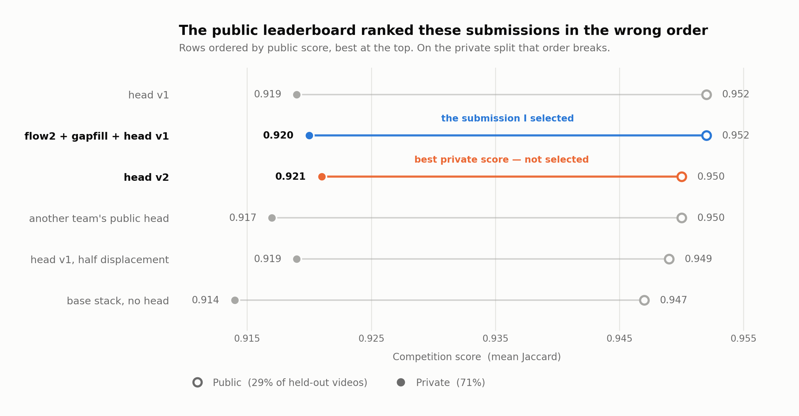

# BioHub Cell Tracking — a bronze medal from my own sub-voxel refinement head

Solution to the Kaggle competition [BioHub – Cell Tracking During Development](https://www.kaggle.com/competitions/biohub-cell-tracking-during-development):
track every cell of an embryo across 3D microscopy videos and reconstruct its lineage. On top of the public
detection-and-linking stack I added a tiny network that corrects the position of each detected cell. That piece is
what earned the medal.



## Result

**Bronze: 371st of 4,020 teams on the final private leaderboard** (391st before Kaggle's post-close verification;
the bronze cut sat at 401st).

Same submissions, public (29% of the held-out videos) against private (71%):

| submission | what changes | public | **private** |
| --- | --- | --- | --- |
| base stack, no head | — | 0.947 | 0.914 |
| stack + head v1 | head trained on 24 videos | **0.952** | 0.919 |
| stack + flow2 + gapfill + head v1 — **the selected one** | | **0.952** | **0.920 → bronze** |
| same with head v2 | head trained on 64 videos | 0.950 | **0.921** (the best, not selected) |
| same with another participant's public head | the one hundreds of teams used | 0.950 | 0.917 |
| same with head v1 at half scale | displacement × 0.5 | 0.949 | 0.919 |

The head is worth **+0.006 on the private leaderboard** (0.914 → 0.920). Without it there was no medal.

## The finding that structures the solution

**Where the cells are mattered more than how they are linked.** I tried eight variants of the detection threshold,
the linking and the post-processing (including a flow prior that gained +0.0099 on the local bench); all of them
stayed at 0.947. The only thing that pulled a submission out of that block was moving each detection by at most 2 µm.

**For the head, the local measurement was right and the public leaderboard was wrong.** Across 12 videos that none of
my heads saw during training, the mean detection→true-cell distance drops by 26.65% with v2, 25.71% with v1 and
10.22% with the public head. The private leaderboard gave the same ordering: 0.921 > 0.920 > 0.917. The public one,
built on about 40 videos, said the opposite — and it was the one I used to pick the two final submissions. That is
why the best private score was left out.

## Architecture

- **Input:** 224 values per detection — the UNet's 32 channels at the detection plus the differences against its 6
  neighbours, on the subsampled (1, 4, 4) grid, which at 1.625 µm/voxel is isotropic.
- **Network:** MLP 224 → 32 → 3 (SiLU), 7,299 parameters. The last layer starts at zero, so it begins by moving
  nothing. The output is bounded to 2 µm (`2·d / (1 + |d|)`).
- **Three coupled changes** in the prediction script (`patch_predictor()`): refine immediately after detecting, do
  **not** round to integers when rescaling, and index the transformer features with **trilinear** interpolation. The
  default integer indexing truncates (12.7 → 12) and would read the wrong cell.
- **Training:** I capture the features on training videos and match each detection to its true cell (Hungarian
  algorithm at 7 µm, the radius of the official metric). I measure **per video** and **per unseen embryo**, with a
  gate: if it does not improve on the held-out videos, the head is not used. v1 improves 6 of 6 held-out videos
  (−20.5%) and, trained on one embryo and measured on the other, −6.5% and −13.6%.

## What was measured and did not work

- **Neighbour flow prior (flow2) and gapfill:** +0.0099 Jaccard on the local bench (17 of 24 videos improve), zero on
  both public and private. The detector weights had already seen those labelled videos, so the bench was optimistic.
- **A more permissive division veto** (0.25 → 0.15): −0.002 on the public leaderboard. **Z-flip TTA:** −0.006.
- **Divisions learned with the transformer:** 40–60 false positives per true one at any threshold.
- **A "more conservative" head** (half the displacement): worse on both public and private (0.949 / 0.919).
- **Dropping the validator from the public pipeline** to save time: −0.001, confirmed by three sources.

## Limitations and next steps

- The detector and the edge model are the public ones (I did not retrain them). The head is trained on videos those
  weights have already seen, and it is measured that way.
- Each variant was submitted exactly once: differences of 0.001 on the public leaderboard are within the noise.
- The next step would have been training the head on all 199 labelled videos. Another participant published that
  after the close.

## Reproducing

```bash
pip install -r requirements.txt
pytest -q tests/     # module contract: 224 inputs, displacement ≤ 2 µm, trilinear = gather on integers
```

The full pipeline runs on Kaggle (T4 GPU, 12 h cap): **[public notebook](https://www.kaggle.com/code/marcmaldonado/biohub-sub-voxel-head-0-921-private)**,
which loads the head from the **[public dataset](https://www.kaggle.com/datasets/marcmaldonado/biohub-coordref-head-public)**
(v1 and v2, with the training logs). To train your own head:

```python
import coordref
coordref.patch_predictor("scripts/predict_unet_transformer.py", mode="capture")  # dumps <video>/<t>.npz
```
```bash
python coordref/train_coordref.py --captures captures/ --train-dir train/ --out head.pt              # split by video
python coordref/train_coordref.py --captures captures/ --train-dir train/ --out head.pt --val-prefix 44b6   # unseen embryo
```

## Credits

The idea and the architecture of the head are **anvithpothula's** (public notebook *biohub-0-953-lb-original*); this
code is an independent reimplementation, trained on more data. The stack it sits on: detector, DeepCenter and
*support pack* by **pilkwang**; *harmonic-fusion v30* by **flexonafft**; `ILP_DIVISION_WEIGHT` 0.6 by
**zhehaoliang**; `SECONDARY_EDGE_FEATURE_TTA_WEIGHT` 1.0 by **sjlee101**; flow2 and gapfill by **thtennant**.

MIT licence.
